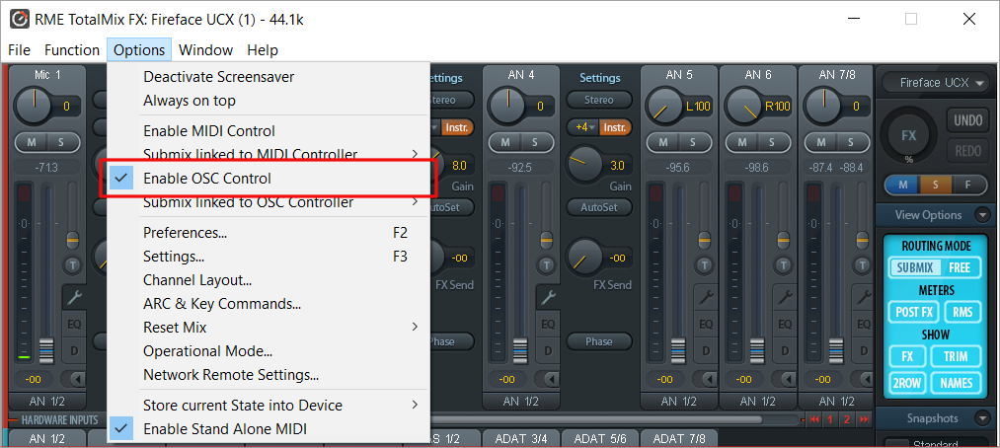
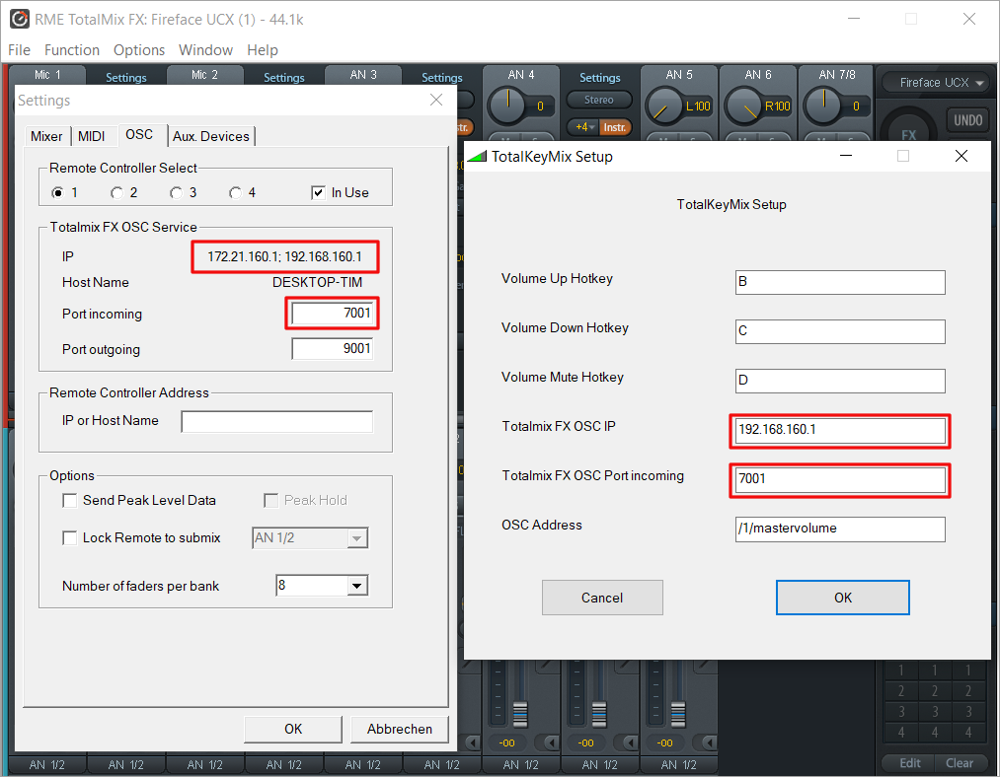
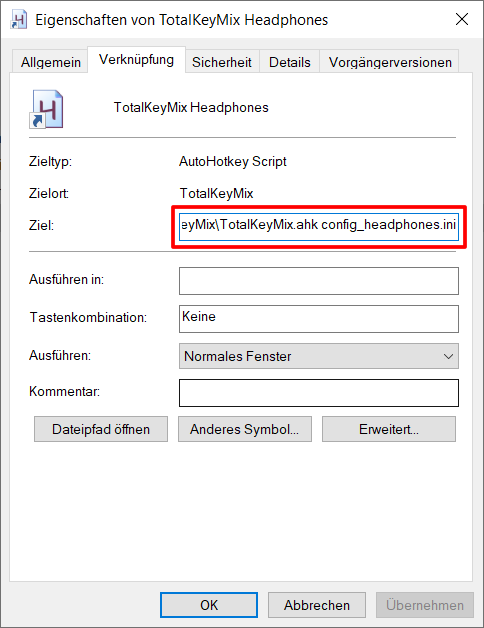
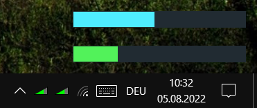

# TotalKeyMix

TotalKeyMix is a tool to control the volume of [RME TotalMix][1] using hotkeys
under Microsoft Windows. It is implemented in [AutoHotKey][2].

[1]: https://www.rme-audio.de/de_totalmix-fx.html
[2]: https://www.autohotkey.com

## OSC Setup

TotalKeyMix controls TotalMix FX via [OSC][3], which is a network based
communication protocol. In order to receive the OSC messages, OSC control has to
be enabled in TotalMix FX:

Usually TotalKeyMix should then work out of the box with its default
configuration, which uses your keyboard's `Volume Up`, `Volume Down` and `Mute`
keys to control TotalMix FX's "Main" volume fader.

If the fader doesn't move, though, make sure that the IP address and port are
configured in TotalKeyMix just like they are displayed in TotalMix FX's settings
under the OSC tab. If TotalMix FX displays more than one IP address, choose only
one of them:

[3]: https://ccrma.stanford.edu/groups/osc/index.html

## TotalKeyMix settings

TotalKeyMix is configured via a [configuration file][5]. The possible settings
are documented right in there.

Usually TotalKeyMix loads the default file `config.ini`. The file name can be
passed as a parameter to TotalKeyMix, though, e.g. via a [Windows shortcut][12]:

This makes it possible to have multiple instances running in parallel using
different configurations, e.g. one for the [main volume][13] and one for the
[headphones volume][14], using different keys and colors or screen positions:

[5]: config.ini
[12]: https://www.digitalcitizen.life/shortcut-arguments-parameters-windows/
[13]: https://github.com/carlfriedrich/TotalKeyMix/blob/myconfig/config_main.ini
[14]: https://github.com/carlfriedrich/TotalKeyMix/blob/myconfig/config_headphones.ini

## History

TotalKeyMix was originally created by [Stephan Römer][6], who published it on
the [RME-audio forum][7] and on [his website][8]. Later, Petre Ikonomov extended
it and posted his updated version on the [Autohotkey forum][9].
[carlfriedrich][10] took these versions and transferred them to [GitHub][11],
where the project is maintained ever since.

[6]:  https://github.com/StephanRoemer
[7]:  https://www.forum.rme-audio.de/viewtopic.php?id=8343
[8]:  http://web.archive.org/web/20160508150718/http://www.stephanroemer.net/stuff/totalkeymix/totalkeymix.html
[9]:  https://www.autohotkey.com/boards/viewtopic.php?f=6&t=42686
[10]: https://github.com/carlfriedrich
[11]: https://github.com/carlfriedrich/TotalKeyMix
