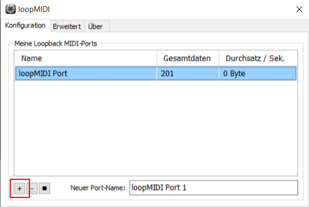
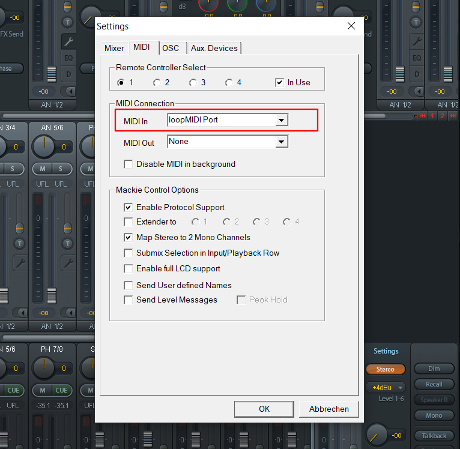
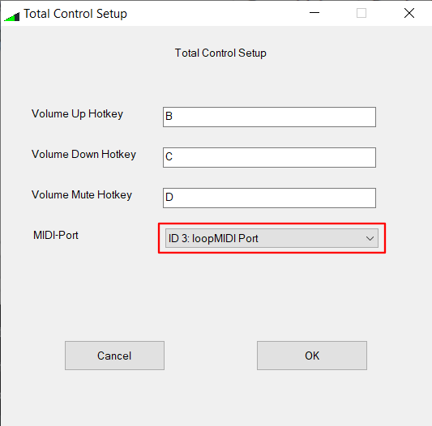
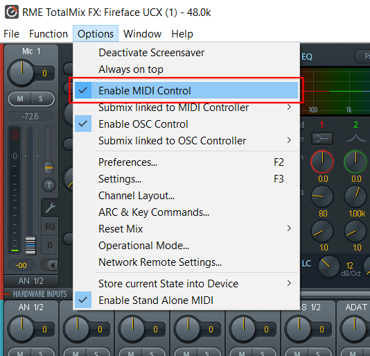

# MIDI Sonfiguration

## Virtual MIDI port

TotalKeyMix needs a virtual loopback MIDI driver like [LoopMidi][1] or
[LoopBe1][2] to be set up. This picture shows LoopMidi as an example:

On the first start, add a new port via the "+" Button.

[1]: https://www.tobias-erichsen.de/software/loopmidi.html
[2]: https://nerds.de/en/loopbe1.html

## MIDI settings

The virtual loopback MIDI port has to be configured as MIDI In port in TotalMix:

And as MIDI-Port in TotalKeyMix (accessible via tray icon):

Furthermore, MIDI control has to be enabled in TotalMix:

